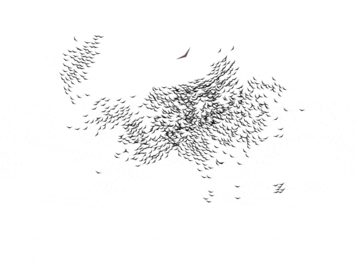

#Flocking boids

[Demo](https://gleb-lobastov.github.io/flocking-boids/)

Simulation of the group of items (boids) with flocking behavior, that can be rendered on the provided canvas

### How it looks

### How to run Demo locally
git clone https://github.com/gleb-lobastov/flocking-boids.git
npm i
npm start
